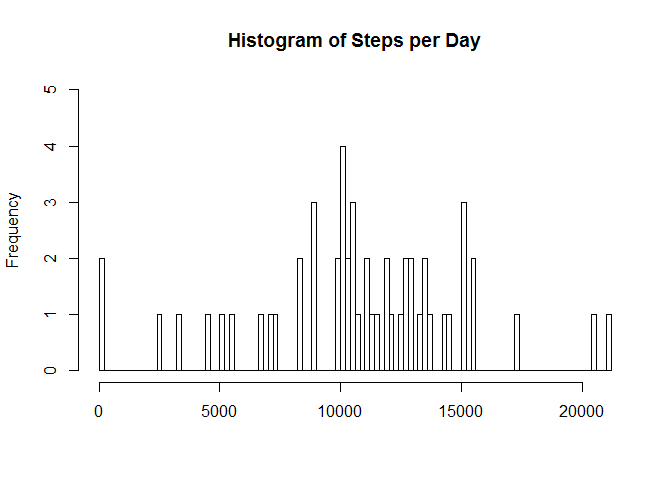
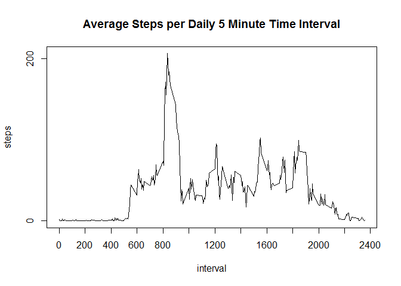
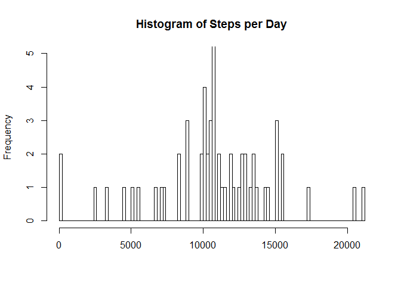
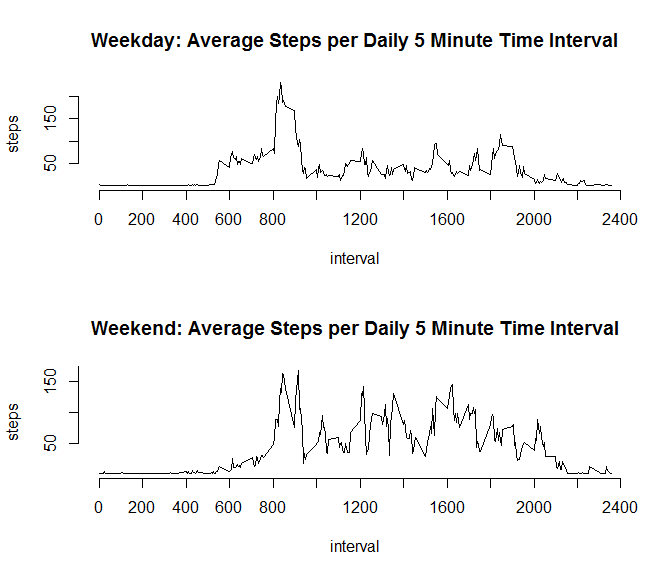

# Reproducible Research: Peer Assessment 1


## Loading and preprocessing the data
I load the data from activity.csv and convert the date collumn to class=date.

```r
library(dplyr)
steps.df <- read.csv("activity.csv", stringsAsFactors = FALSE)
steps.df$date <-as.Date(steps.df$date)
```

## What is mean total number of steps taken per day?

```r
stepsPerDay <- aggregate(steps ~  date, data=steps.df, sum)
hist(stepsPerDay$steps, breaks=100, main="Histogram of Steps per Day", xlab = "", ylim=range(0:5))
```

 

```r
stepsPerDay.mean <- as.character(round(mean(stepsPerDay$steps)))
stepsPerDay.median <- as.character(median(stepsPerDay$steps))
```
The mean steps per day are 10766 and the median is 10765.

## What is the average daily activity pattern?

```r
stepsPerDay <- aggregate(steps ~  date, data=steps.df, sum)
hist(stepsPerDay$steps, breaks=100, main="Histogram of Steps per Day", xlab = "", ylim=range(0:5))
```

 

```r
stepsPerDay.mean <- mean(stepsPerDay$steps)
stepsPerDay.median <- median(stepsPerDay$steps)
stepsPerInterval <- aggregate(steps ~  interval, data=steps.df, mean)
plot(stepsPerInterval, type="l", main="Average Steps per Daily 5 Minute Time Interval", 
     at=seq(0,2400,200))
```

 

```r
IntervalWithMostSteps <-stepsPerInterval[stepsPerInterval$steps==max(stepsPerInterval$steps),]
```
The interval with the most steps is 835 with 206.17 steps.

## Imputing missing values

```r
NACount <- sum(is.na(steps.df$steps))
```
There are 2304 records with missing/NA step values.
There are also many records with 0 values, but we do not consider those to be missing because it should mean that the person did not take any steps.


```r
#Make a copy of data set and replace NA value with the average steps for that intval
NAfilled.df <- steps.df

for (i in 1:nrow(NAfilled.df)) {
  if (is.na(NAfilled.df[i,]$steps)) {
    meanSteps <- stepsPerInterval[stepsPerInterval$interval==NAfilled.df[i,]$interval,]
    print(meanSteps$steps)
    NAfilled.df[i,]$steps <- meanSteps$steps
  }
}
```

```
## [1] 1.716981
## [1] 0.3396226
## [1] 0.1320755
## [1] 0.1509434
## [1] 0.0754717
## [1] 2.09434
## [1] 0.5283019
## [1] 0.8679245
## [1] 0
## [1] 1.471698
## [1] 0.3018868
## [1] 0.1320755
## [1] 0.3207547
## [1] 0.6792453
## [1] 0.1509434
## [1] 0.3396226
## [1] 0
## [1] 1.113208
## [1] 1.830189
## [1] 0.1698113
## [1] 0.1698113
## [1] 0.3773585
## [1] 0.2641509
## [1] 0
## [1] 0
## [1] 0
## [1] 1.132075
## [1] 0
## [1] 0
## [1] 0.1320755
## [1] 0
## [1] 0.2264151
## [1] 0
## [1] 0
## [1] 1.54717
## [1] 0.9433962
## [1] 0
## [1] 0
## [1] 0
## [1] 0
## [1] 0.2075472
## [1] 0.6226415
## [1] 1.622642
## [1] 0.5849057
## [1] 0.490566
## [1] 0.0754717
## [1] 0
## [1] 0
## [1] 1.188679
## [1] 0.9433962
## [1] 2.566038
## [1] 0
## [1] 0.3396226
## [1] 0.3584906
## [1] 4.113208
## [1] 0.6603774
## [1] 3.490566
## [1] 0.8301887
## [1] 3.113208
## [1] 1.113208
## [1] 0
## [1] 1.566038
## [1] 3
## [1] 2.245283
## [1] 3.320755
## [1] 2.962264
## [1] 2.09434
## [1] 6.056604
## [1] 16.01887
## [1] 18.33962
## [1] 39.45283
## [1] 44.49057
## [1] 31.49057
## [1] 49.26415
## [1] 53.77358
## [1] 63.45283
## [1] 49.96226
## [1] 47.07547
## [1] 52.15094
## [1] 39.33962
## [1] 44.01887
## [1] 44.16981
## [1] 37.35849
## [1] 49.03774
## [1] 43.81132
## [1] 44.37736
## [1] 50.50943
## [1] 54.50943
## [1] 49.92453
## [1] 50.98113
## [1] 55.67925
## [1] 44.32075
## [1] 52.26415
## [1] 69.54717
## [1] 57.84906
## [1] 56.15094
## [1] 73.37736
## [1] 68.20755
## [1] 129.434
## [1] 157.5283
## [1] 171.1509
## [1] 155.3962
## [1] 177.3019
## [1] 206.1698
## [1] 195.9245
## [1] 179.566
## [1] 183.3962
## [1] 167.0189
## [1] 143.4528
## [1] 124.0377
## [1] 109.1132
## [1] 108.1132
## [1] 103.717
## [1] 95.96226
## [1] 66.20755
## [1] 45.22642
## [1] 24.79245
## [1] 38.75472
## [1] 34.98113
## [1] 21.0566
## [1] 40.56604
## [1] 26.98113
## [1] 42.41509
## [1] 52.66038
## [1] 38.92453
## [1] 50.79245
## [1] 44.28302
## [1] 37.41509
## [1] 34.69811
## [1] 28.33962
## [1] 25.09434
## [1] 31.9434
## [1] 31.35849
## [1] 29.67925
## [1] 21.32075
## [1] 25.54717
## [1] 28.37736
## [1] 26.4717
## [1] 33.43396
## [1] 49.98113
## [1] 42.03774
## [1] 44.60377
## [1] 46.03774
## [1] 59.18868
## [1] 63.86792
## [1] 87.69811
## [1] 94.84906
## [1] 92.77358
## [1] 63.39623
## [1] 50.16981
## [1] 54.4717
## [1] 32.41509
## [1] 26.5283
## [1] 37.73585
## [1] 45.0566
## [1] 67.28302
## [1] 42.33962
## [1] 39.88679
## [1] 43.26415
## [1] 40.98113
## [1] 46.24528
## [1] 56.43396
## [1] 42.75472
## [1] 25.13208
## [1] 39.96226
## [1] 53.54717
## [1] 47.32075
## [1] 60.81132
## [1] 55.75472
## [1] 51.96226
## [1] 43.58491
## [1] 48.69811
## [1] 35.4717
## [1] 37.54717
## [1] 41.84906
## [1] 27.50943
## [1] 17.11321
## [1] 26.07547
## [1] 43.62264
## [1] 43.77358
## [1] 30.01887
## [1] 36.07547
## [1] 35.49057
## [1] 38.84906
## [1] 45.96226
## [1] 47.75472
## [1] 48.13208
## [1] 65.32075
## [1] 82.90566
## [1] 98.66038
## [1] 102.1132
## [1] 83.96226
## [1] 62.13208
## [1] 64.13208
## [1] 74.54717
## [1] 63.16981
## [1] 56.90566
## [1] 59.77358
## [1] 43.86792
## [1] 38.56604
## [1] 44.66038
## [1] 45.45283
## [1] 46.20755
## [1] 43.67925
## [1] 46.62264
## [1] 56.30189
## [1] 50.71698
## [1] 61.22642
## [1] 72.71698
## [1] 78.9434
## [1] 68.9434
## [1] 59.66038
## [1] 75.09434
## [1] 56.50943
## [1] 34.77358
## [1] 37.45283
## [1] 40.67925
## [1] 58.01887
## [1] 74.69811
## [1] 85.32075
## [1] 59.26415
## [1] 67.77358
## [1] 77.69811
## [1] 74.24528
## [1] 85.33962
## [1] 99.45283
## [1] 86.58491
## [1] 85.60377
## [1] 84.86792
## [1] 77.83019
## [1] 58.03774
## [1] 53.35849
## [1] 36.32075
## [1] 20.71698
## [1] 27.39623
## [1] 40.01887
## [1] 30.20755
## [1] 25.54717
## [1] 45.66038
## [1] 33.5283
## [1] 19.62264
## [1] 19.01887
## [1] 19.33962
## [1] 33.33962
## [1] 26.81132
## [1] 21.16981
## [1] 27.30189
## [1] 21.33962
## [1] 19.54717
## [1] 21.32075
## [1] 32.30189
## [1] 20.15094
## [1] 15.9434
## [1] 17.22642
## [1] 23.45283
## [1] 19.24528
## [1] 12.45283
## [1] 8.018868
## [1] 14.66038
## [1] 16.30189
## [1] 8.679245
## [1] 7.792453
## [1] 8.132075
## [1] 2.622642
## [1] 1.45283
## [1] 3.679245
## [1] 4.811321
## [1] 8.509434
## [1] 7.075472
## [1] 8.698113
## [1] 9.754717
## [1] 2.207547
## [1] 0.3207547
## [1] 0.1132075
## [1] 1.603774
## [1] 4.603774
## [1] 3.301887
## [1] 2.849057
## [1] 0
## [1] 0.8301887
## [1] 0.9622642
## [1] 1.584906
## [1] 2.603774
## [1] 4.698113
## [1] 3.301887
## [1] 0.6415094
## [1] 0.2264151
## [1] 1.075472
## [1] 1.716981
## [1] 0.3396226
## [1] 0.1320755
## [1] 0.1509434
## [1] 0.0754717
## [1] 2.09434
## [1] 0.5283019
## [1] 0.8679245
## [1] 0
## [1] 1.471698
## [1] 0.3018868
## [1] 0.1320755
## [1] 0.3207547
## [1] 0.6792453
## [1] 0.1509434
## [1] 0.3396226
## [1] 0
## [1] 1.113208
## [1] 1.830189
## [1] 0.1698113
## [1] 0.1698113
## [1] 0.3773585
## [1] 0.2641509
## [1] 0
## [1] 0
## [1] 0
## [1] 1.132075
## [1] 0
## [1] 0
## [1] 0.1320755
## [1] 0
## [1] 0.2264151
## [1] 0
## [1] 0
## [1] 1.54717
## [1] 0.9433962
## [1] 0
## [1] 0
## [1] 0
## [1] 0
## [1] 0.2075472
## [1] 0.6226415
## [1] 1.622642
## [1] 0.5849057
## [1] 0.490566
## [1] 0.0754717
## [1] 0
## [1] 0
## [1] 1.188679
## [1] 0.9433962
## [1] 2.566038
## [1] 0
## [1] 0.3396226
## [1] 0.3584906
## [1] 4.113208
## [1] 0.6603774
## [1] 3.490566
## [1] 0.8301887
## [1] 3.113208
## [1] 1.113208
## [1] 0
## [1] 1.566038
## [1] 3
## [1] 2.245283
## [1] 3.320755
## [1] 2.962264
## [1] 2.09434
## [1] 6.056604
## [1] 16.01887
## [1] 18.33962
## [1] 39.45283
## [1] 44.49057
## [1] 31.49057
## [1] 49.26415
## [1] 53.77358
## [1] 63.45283
## [1] 49.96226
## [1] 47.07547
## [1] 52.15094
## [1] 39.33962
## [1] 44.01887
## [1] 44.16981
## [1] 37.35849
## [1] 49.03774
## [1] 43.81132
## [1] 44.37736
## [1] 50.50943
## [1] 54.50943
## [1] 49.92453
## [1] 50.98113
## [1] 55.67925
## [1] 44.32075
## [1] 52.26415
## [1] 69.54717
## [1] 57.84906
## [1] 56.15094
## [1] 73.37736
## [1] 68.20755
## [1] 129.434
## [1] 157.5283
## [1] 171.1509
## [1] 155.3962
## [1] 177.3019
## [1] 206.1698
## [1] 195.9245
## [1] 179.566
## [1] 183.3962
## [1] 167.0189
## [1] 143.4528
## [1] 124.0377
## [1] 109.1132
## [1] 108.1132
## [1] 103.717
## [1] 95.96226
## [1] 66.20755
## [1] 45.22642
## [1] 24.79245
## [1] 38.75472
## [1] 34.98113
## [1] 21.0566
## [1] 40.56604
## [1] 26.98113
## [1] 42.41509
## [1] 52.66038
## [1] 38.92453
## [1] 50.79245
## [1] 44.28302
## [1] 37.41509
## [1] 34.69811
## [1] 28.33962
## [1] 25.09434
## [1] 31.9434
## [1] 31.35849
## [1] 29.67925
## [1] 21.32075
## [1] 25.54717
## [1] 28.37736
## [1] 26.4717
## [1] 33.43396
## [1] 49.98113
## [1] 42.03774
## [1] 44.60377
## [1] 46.03774
## [1] 59.18868
## [1] 63.86792
## [1] 87.69811
## [1] 94.84906
## [1] 92.77358
## [1] 63.39623
## [1] 50.16981
## [1] 54.4717
## [1] 32.41509
## [1] 26.5283
## [1] 37.73585
## [1] 45.0566
## [1] 67.28302
## [1] 42.33962
## [1] 39.88679
## [1] 43.26415
## [1] 40.98113
## [1] 46.24528
## [1] 56.43396
## [1] 42.75472
## [1] 25.13208
## [1] 39.96226
## [1] 53.54717
## [1] 47.32075
## [1] 60.81132
## [1] 55.75472
## [1] 51.96226
## [1] 43.58491
## [1] 48.69811
## [1] 35.4717
## [1] 37.54717
## [1] 41.84906
## [1] 27.50943
## [1] 17.11321
## [1] 26.07547
## [1] 43.62264
## [1] 43.77358
## [1] 30.01887
## [1] 36.07547
## [1] 35.49057
## [1] 38.84906
## [1] 45.96226
## [1] 47.75472
## [1] 48.13208
## [1] 65.32075
## [1] 82.90566
## [1] 98.66038
## [1] 102.1132
## [1] 83.96226
## [1] 62.13208
## [1] 64.13208
## [1] 74.54717
## [1] 63.16981
## [1] 56.90566
## [1] 59.77358
## [1] 43.86792
## [1] 38.56604
## [1] 44.66038
## [1] 45.45283
## [1] 46.20755
## [1] 43.67925
## [1] 46.62264
## [1] 56.30189
## [1] 50.71698
## [1] 61.22642
## [1] 72.71698
## [1] 78.9434
## [1] 68.9434
## [1] 59.66038
## [1] 75.09434
## [1] 56.50943
## [1] 34.77358
## [1] 37.45283
## [1] 40.67925
## [1] 58.01887
## [1] 74.69811
## [1] 85.32075
## [1] 59.26415
## [1] 67.77358
## [1] 77.69811
## [1] 74.24528
## [1] 85.33962
## [1] 99.45283
## [1] 86.58491
## [1] 85.60377
## [1] 84.86792
## [1] 77.83019
## [1] 58.03774
## [1] 53.35849
## [1] 36.32075
## [1] 20.71698
## [1] 27.39623
## [1] 40.01887
## [1] 30.20755
## [1] 25.54717
## [1] 45.66038
## [1] 33.5283
## [1] 19.62264
## [1] 19.01887
## [1] 19.33962
## [1] 33.33962
## [1] 26.81132
## [1] 21.16981
## [1] 27.30189
## [1] 21.33962
## [1] 19.54717
## [1] 21.32075
## [1] 32.30189
## [1] 20.15094
## [1] 15.9434
## [1] 17.22642
## [1] 23.45283
## [1] 19.24528
## [1] 12.45283
## [1] 8.018868
## [1] 14.66038
## [1] 16.30189
## [1] 8.679245
## [1] 7.792453
## [1] 8.132075
## [1] 2.622642
## [1] 1.45283
## [1] 3.679245
## [1] 4.811321
## [1] 8.509434
## [1] 7.075472
## [1] 8.698113
## [1] 9.754717
## [1] 2.207547
## [1] 0.3207547
## [1] 0.1132075
## [1] 1.603774
## [1] 4.603774
## [1] 3.301887
## [1] 2.849057
## [1] 0
## [1] 0.8301887
## [1] 0.9622642
## [1] 1.584906
## [1] 2.603774
## [1] 4.698113
## [1] 3.301887
## [1] 0.6415094
## [1] 0.2264151
## [1] 1.075472
## [1] 1.716981
## [1] 0.3396226
## [1] 0.1320755
## [1] 0.1509434
## [1] 0.0754717
## [1] 2.09434
## [1] 0.5283019
## [1] 0.8679245
## [1] 0
## [1] 1.471698
## [1] 0.3018868
## [1] 0.1320755
## [1] 0.3207547
## [1] 0.6792453
## [1] 0.1509434
## [1] 0.3396226
## [1] 0
## [1] 1.113208
## [1] 1.830189
## [1] 0.1698113
## [1] 0.1698113
## [1] 0.3773585
## [1] 0.2641509
## [1] 0
## [1] 0
## [1] 0
## [1] 1.132075
## [1] 0
## [1] 0
## [1] 0.1320755
## [1] 0
## [1] 0.2264151
## [1] 0
## [1] 0
## [1] 1.54717
## [1] 0.9433962
## [1] 0
## [1] 0
## [1] 0
## [1] 0
## [1] 0.2075472
## [1] 0.6226415
## [1] 1.622642
## [1] 0.5849057
## [1] 0.490566
## [1] 0.0754717
## [1] 0
## [1] 0
## [1] 1.188679
## [1] 0.9433962
## [1] 2.566038
## [1] 0
## [1] 0.3396226
## [1] 0.3584906
## [1] 4.113208
## [1] 0.6603774
## [1] 3.490566
## [1] 0.8301887
## [1] 3.113208
## [1] 1.113208
## [1] 0
## [1] 1.566038
## [1] 3
## [1] 2.245283
## [1] 3.320755
## [1] 2.962264
## [1] 2.09434
## [1] 6.056604
## [1] 16.01887
## [1] 18.33962
## [1] 39.45283
## [1] 44.49057
## [1] 31.49057
## [1] 49.26415
## [1] 53.77358
## [1] 63.45283
## [1] 49.96226
## [1] 47.07547
## [1] 52.15094
## [1] 39.33962
## [1] 44.01887
## [1] 44.16981
## [1] 37.35849
## [1] 49.03774
## [1] 43.81132
## [1] 44.37736
## [1] 50.50943
## [1] 54.50943
## [1] 49.92453
## [1] 50.98113
## [1] 55.67925
## [1] 44.32075
## [1] 52.26415
## [1] 69.54717
## [1] 57.84906
## [1] 56.15094
## [1] 73.37736
## [1] 68.20755
## [1] 129.434
## [1] 157.5283
## [1] 171.1509
## [1] 155.3962
## [1] 177.3019
## [1] 206.1698
## [1] 195.9245
## [1] 179.566
## [1] 183.3962
## [1] 167.0189
## [1] 143.4528
## [1] 124.0377
## [1] 109.1132
## [1] 108.1132
## [1] 103.717
## [1] 95.96226
## [1] 66.20755
## [1] 45.22642
## [1] 24.79245
## [1] 38.75472
## [1] 34.98113
## [1] 21.0566
## [1] 40.56604
## [1] 26.98113
## [1] 42.41509
## [1] 52.66038
## [1] 38.92453
## [1] 50.79245
## [1] 44.28302
## [1] 37.41509
## [1] 34.69811
## [1] 28.33962
## [1] 25.09434
## [1] 31.9434
## [1] 31.35849
## [1] 29.67925
## [1] 21.32075
## [1] 25.54717
## [1] 28.37736
## [1] 26.4717
## [1] 33.43396
## [1] 49.98113
## [1] 42.03774
## [1] 44.60377
## [1] 46.03774
## [1] 59.18868
## [1] 63.86792
## [1] 87.69811
## [1] 94.84906
## [1] 92.77358
## [1] 63.39623
## [1] 50.16981
## [1] 54.4717
## [1] 32.41509
## [1] 26.5283
## [1] 37.73585
## [1] 45.0566
## [1] 67.28302
## [1] 42.33962
## [1] 39.88679
## [1] 43.26415
## [1] 40.98113
## [1] 46.24528
## [1] 56.43396
## [1] 42.75472
## [1] 25.13208
## [1] 39.96226
## [1] 53.54717
## [1] 47.32075
## [1] 60.81132
## [1] 55.75472
## [1] 51.96226
## [1] 43.58491
## [1] 48.69811
## [1] 35.4717
## [1] 37.54717
## [1] 41.84906
## [1] 27.50943
## [1] 17.11321
## [1] 26.07547
## [1] 43.62264
## [1] 43.77358
## [1] 30.01887
## [1] 36.07547
## [1] 35.49057
## [1] 38.84906
## [1] 45.96226
## [1] 47.75472
## [1] 48.13208
## [1] 65.32075
## [1] 82.90566
## [1] 98.66038
## [1] 102.1132
## [1] 83.96226
## [1] 62.13208
## [1] 64.13208
## [1] 74.54717
## [1] 63.16981
## [1] 56.90566
## [1] 59.77358
## [1] 43.86792
## [1] 38.56604
## [1] 44.66038
## [1] 45.45283
## [1] 46.20755
## [1] 43.67925
## [1] 46.62264
## [1] 56.30189
## [1] 50.71698
## [1] 61.22642
## [1] 72.71698
## [1] 78.9434
## [1] 68.9434
## [1] 59.66038
## [1] 75.09434
## [1] 56.50943
## [1] 34.77358
## [1] 37.45283
## [1] 40.67925
## [1] 58.01887
## [1] 74.69811
## [1] 85.32075
## [1] 59.26415
## [1] 67.77358
## [1] 77.69811
## [1] 74.24528
## [1] 85.33962
## [1] 99.45283
## [1] 86.58491
## [1] 85.60377
## [1] 84.86792
## [1] 77.83019
## [1] 58.03774
## [1] 53.35849
## [1] 36.32075
## [1] 20.71698
## [1] 27.39623
## [1] 40.01887
## [1] 30.20755
## [1] 25.54717
## [1] 45.66038
## [1] 33.5283
## [1] 19.62264
## [1] 19.01887
## [1] 19.33962
## [1] 33.33962
## [1] 26.81132
## [1] 21.16981
## [1] 27.30189
## [1] 21.33962
## [1] 19.54717
## [1] 21.32075
## [1] 32.30189
## [1] 20.15094
## [1] 15.9434
## [1] 17.22642
## [1] 23.45283
## [1] 19.24528
## [1] 12.45283
## [1] 8.018868
## [1] 14.66038
## [1] 16.30189
## [1] 8.679245
## [1] 7.792453
## [1] 8.132075
## [1] 2.622642
## [1] 1.45283
## [1] 3.679245
## [1] 4.811321
## [1] 8.509434
## [1] 7.075472
## [1] 8.698113
## [1] 9.754717
## [1] 2.207547
## [1] 0.3207547
## [1] 0.1132075
## [1] 1.603774
## [1] 4.603774
## [1] 3.301887
## [1] 2.849057
## [1] 0
## [1] 0.8301887
## [1] 0.9622642
## [1] 1.584906
## [1] 2.603774
## [1] 4.698113
## [1] 3.301887
## [1] 0.6415094
## [1] 0.2264151
## [1] 1.075472
## [1] 1.716981
## [1] 0.3396226
## [1] 0.1320755
## [1] 0.1509434
## [1] 0.0754717
## [1] 2.09434
## [1] 0.5283019
## [1] 0.8679245
## [1] 0
## [1] 1.471698
## [1] 0.3018868
## [1] 0.1320755
## [1] 0.3207547
## [1] 0.6792453
## [1] 0.1509434
## [1] 0.3396226
## [1] 0
## [1] 1.113208
## [1] 1.830189
## [1] 0.1698113
## [1] 0.1698113
## [1] 0.3773585
## [1] 0.2641509
## [1] 0
## [1] 0
## [1] 0
## [1] 1.132075
## [1] 0
## [1] 0
## [1] 0.1320755
## [1] 0
## [1] 0.2264151
## [1] 0
## [1] 0
## [1] 1.54717
## [1] 0.9433962
## [1] 0
## [1] 0
## [1] 0
## [1] 0
## [1] 0.2075472
## [1] 0.6226415
## [1] 1.622642
## [1] 0.5849057
## [1] 0.490566
## [1] 0.0754717
## [1] 0
## [1] 0
## [1] 1.188679
## [1] 0.9433962
## [1] 2.566038
## [1] 0
## [1] 0.3396226
## [1] 0.3584906
## [1] 4.113208
## [1] 0.6603774
## [1] 3.490566
## [1] 0.8301887
## [1] 3.113208
## [1] 1.113208
## [1] 0
## [1] 1.566038
## [1] 3
## [1] 2.245283
## [1] 3.320755
## [1] 2.962264
## [1] 2.09434
## [1] 6.056604
## [1] 16.01887
## [1] 18.33962
## [1] 39.45283
## [1] 44.49057
## [1] 31.49057
## [1] 49.26415
## [1] 53.77358
## [1] 63.45283
## [1] 49.96226
## [1] 47.07547
## [1] 52.15094
## [1] 39.33962
## [1] 44.01887
## [1] 44.16981
## [1] 37.35849
## [1] 49.03774
## [1] 43.81132
## [1] 44.37736
## [1] 50.50943
## [1] 54.50943
## [1] 49.92453
## [1] 50.98113
## [1] 55.67925
## [1] 44.32075
## [1] 52.26415
## [1] 69.54717
## [1] 57.84906
## [1] 56.15094
## [1] 73.37736
## [1] 68.20755
## [1] 129.434
## [1] 157.5283
## [1] 171.1509
## [1] 155.3962
## [1] 177.3019
## [1] 206.1698
## [1] 195.9245
## [1] 179.566
## [1] 183.3962
## [1] 167.0189
## [1] 143.4528
## [1] 124.0377
## [1] 109.1132
## [1] 108.1132
## [1] 103.717
## [1] 95.96226
## [1] 66.20755
## [1] 45.22642
## [1] 24.79245
## [1] 38.75472
## [1] 34.98113
## [1] 21.0566
## [1] 40.56604
## [1] 26.98113
## [1] 42.41509
## [1] 52.66038
## [1] 38.92453
## [1] 50.79245
## [1] 44.28302
## [1] 37.41509
## [1] 34.69811
## [1] 28.33962
## [1] 25.09434
## [1] 31.9434
## [1] 31.35849
## [1] 29.67925
## [1] 21.32075
## [1] 25.54717
## [1] 28.37736
## [1] 26.4717
## [1] 33.43396
## [1] 49.98113
## [1] 42.03774
## [1] 44.60377
## [1] 46.03774
## [1] 59.18868
## [1] 63.86792
## [1] 87.69811
## [1] 94.84906
## [1] 92.77358
## [1] 63.39623
## [1] 50.16981
## [1] 54.4717
## [1] 32.41509
## [1] 26.5283
## [1] 37.73585
## [1] 45.0566
## [1] 67.28302
## [1] 42.33962
## [1] 39.88679
## [1] 43.26415
## [1] 40.98113
## [1] 46.24528
## [1] 56.43396
## [1] 42.75472
## [1] 25.13208
## [1] 39.96226
## [1] 53.54717
## [1] 47.32075
## [1] 60.81132
## [1] 55.75472
## [1] 51.96226
## [1] 43.58491
## [1] 48.69811
## [1] 35.4717
## [1] 37.54717
## [1] 41.84906
## [1] 27.50943
## [1] 17.11321
## [1] 26.07547
## [1] 43.62264
## [1] 43.77358
## [1] 30.01887
## [1] 36.07547
## [1] 35.49057
## [1] 38.84906
## [1] 45.96226
## [1] 47.75472
## [1] 48.13208
## [1] 65.32075
## [1] 82.90566
## [1] 98.66038
## [1] 102.1132
## [1] 83.96226
## [1] 62.13208
## [1] 64.13208
## [1] 74.54717
## [1] 63.16981
## [1] 56.90566
## [1] 59.77358
## [1] 43.86792
## [1] 38.56604
## [1] 44.66038
## [1] 45.45283
## [1] 46.20755
## [1] 43.67925
## [1] 46.62264
## [1] 56.30189
## [1] 50.71698
## [1] 61.22642
## [1] 72.71698
## [1] 78.9434
## [1] 68.9434
## [1] 59.66038
## [1] 75.09434
## [1] 56.50943
## [1] 34.77358
## [1] 37.45283
## [1] 40.67925
## [1] 58.01887
## [1] 74.69811
## [1] 85.32075
## [1] 59.26415
## [1] 67.77358
## [1] 77.69811
## [1] 74.24528
## [1] 85.33962
## [1] 99.45283
## [1] 86.58491
## [1] 85.60377
## [1] 84.86792
## [1] 77.83019
## [1] 58.03774
## [1] 53.35849
## [1] 36.32075
## [1] 20.71698
## [1] 27.39623
## [1] 40.01887
## [1] 30.20755
## [1] 25.54717
## [1] 45.66038
## [1] 33.5283
## [1] 19.62264
## [1] 19.01887
## [1] 19.33962
## [1] 33.33962
## [1] 26.81132
## [1] 21.16981
## [1] 27.30189
## [1] 21.33962
## [1] 19.54717
## [1] 21.32075
## [1] 32.30189
## [1] 20.15094
## [1] 15.9434
## [1] 17.22642
## [1] 23.45283
## [1] 19.24528
## [1] 12.45283
## [1] 8.018868
## [1] 14.66038
## [1] 16.30189
## [1] 8.679245
## [1] 7.792453
## [1] 8.132075
## [1] 2.622642
## [1] 1.45283
## [1] 3.679245
## [1] 4.811321
## [1] 8.509434
## [1] 7.075472
## [1] 8.698113
## [1] 9.754717
## [1] 2.207547
## [1] 0.3207547
## [1] 0.1132075
## [1] 1.603774
## [1] 4.603774
## [1] 3.301887
## [1] 2.849057
## [1] 0
## [1] 0.8301887
## [1] 0.9622642
## [1] 1.584906
## [1] 2.603774
## [1] 4.698113
## [1] 3.301887
## [1] 0.6415094
## [1] 0.2264151
## [1] 1.075472
## [1] 1.716981
## [1] 0.3396226
## [1] 0.1320755
## [1] 0.1509434
## [1] 0.0754717
## [1] 2.09434
## [1] 0.5283019
## [1] 0.8679245
## [1] 0
## [1] 1.471698
## [1] 0.3018868
## [1] 0.1320755
## [1] 0.3207547
## [1] 0.6792453
## [1] 0.1509434
## [1] 0.3396226
## [1] 0
## [1] 1.113208
## [1] 1.830189
## [1] 0.1698113
## [1] 0.1698113
## [1] 0.3773585
## [1] 0.2641509
## [1] 0
## [1] 0
## [1] 0
## [1] 1.132075
## [1] 0
## [1] 0
## [1] 0.1320755
## [1] 0
## [1] 0.2264151
## [1] 0
## [1] 0
## [1] 1.54717
## [1] 0.9433962
## [1] 0
## [1] 0
## [1] 0
## [1] 0
## [1] 0.2075472
## [1] 0.6226415
## [1] 1.622642
## [1] 0.5849057
## [1] 0.490566
## [1] 0.0754717
## [1] 0
## [1] 0
## [1] 1.188679
## [1] 0.9433962
## [1] 2.566038
## [1] 0
## [1] 0.3396226
## [1] 0.3584906
## [1] 4.113208
## [1] 0.6603774
## [1] 3.490566
## [1] 0.8301887
## [1] 3.113208
## [1] 1.113208
## [1] 0
## [1] 1.566038
## [1] 3
## [1] 2.245283
## [1] 3.320755
## [1] 2.962264
## [1] 2.09434
## [1] 6.056604
## [1] 16.01887
## [1] 18.33962
## [1] 39.45283
## [1] 44.49057
## [1] 31.49057
## [1] 49.26415
## [1] 53.77358
## [1] 63.45283
## [1] 49.96226
## [1] 47.07547
## [1] 52.15094
## [1] 39.33962
## [1] 44.01887
## [1] 44.16981
## [1] 37.35849
## [1] 49.03774
## [1] 43.81132
## [1] 44.37736
## [1] 50.50943
## [1] 54.50943
## [1] 49.92453
## [1] 50.98113
## [1] 55.67925
## [1] 44.32075
## [1] 52.26415
## [1] 69.54717
## [1] 57.84906
## [1] 56.15094
## [1] 73.37736
## [1] 68.20755
## [1] 129.434
## [1] 157.5283
## [1] 171.1509
## [1] 155.3962
## [1] 177.3019
## [1] 206.1698
## [1] 195.9245
## [1] 179.566
## [1] 183.3962
## [1] 167.0189
## [1] 143.4528
## [1] 124.0377
## [1] 109.1132
## [1] 108.1132
## [1] 103.717
## [1] 95.96226
## [1] 66.20755
## [1] 45.22642
## [1] 24.79245
## [1] 38.75472
## [1] 34.98113
## [1] 21.0566
## [1] 40.56604
## [1] 26.98113
## [1] 42.41509
## [1] 52.66038
## [1] 38.92453
## [1] 50.79245
## [1] 44.28302
## [1] 37.41509
## [1] 34.69811
## [1] 28.33962
## [1] 25.09434
## [1] 31.9434
## [1] 31.35849
## [1] 29.67925
## [1] 21.32075
## [1] 25.54717
## [1] 28.37736
## [1] 26.4717
## [1] 33.43396
## [1] 49.98113
## [1] 42.03774
## [1] 44.60377
## [1] 46.03774
## [1] 59.18868
## [1] 63.86792
## [1] 87.69811
## [1] 94.84906
## [1] 92.77358
## [1] 63.39623
## [1] 50.16981
## [1] 54.4717
## [1] 32.41509
## [1] 26.5283
## [1] 37.73585
## [1] 45.0566
## [1] 67.28302
## [1] 42.33962
## [1] 39.88679
## [1] 43.26415
## [1] 40.98113
## [1] 46.24528
## [1] 56.43396
## [1] 42.75472
## [1] 25.13208
## [1] 39.96226
## [1] 53.54717
## [1] 47.32075
## [1] 60.81132
## [1] 55.75472
## [1] 51.96226
## [1] 43.58491
## [1] 48.69811
## [1] 35.4717
## [1] 37.54717
## [1] 41.84906
## [1] 27.50943
## [1] 17.11321
## [1] 26.07547
## [1] 43.62264
## [1] 43.77358
## [1] 30.01887
## [1] 36.07547
## [1] 35.49057
## [1] 38.84906
## [1] 45.96226
## [1] 47.75472
## [1] 48.13208
## [1] 65.32075
## [1] 82.90566
## [1] 98.66038
## [1] 102.1132
## [1] 83.96226
## [1] 62.13208
## [1] 64.13208
## [1] 74.54717
## [1] 63.16981
## [1] 56.90566
## [1] 59.77358
## [1] 43.86792
## [1] 38.56604
## [1] 44.66038
## [1] 45.45283
## [1] 46.20755
## [1] 43.67925
## [1] 46.62264
## [1] 56.30189
## [1] 50.71698
## [1] 61.22642
## [1] 72.71698
## [1] 78.9434
## [1] 68.9434
## [1] 59.66038
## [1] 75.09434
## [1] 56.50943
## [1] 34.77358
## [1] 37.45283
## [1] 40.67925
## [1] 58.01887
## [1] 74.69811
## [1] 85.32075
## [1] 59.26415
## [1] 67.77358
## [1] 77.69811
## [1] 74.24528
## [1] 85.33962
## [1] 99.45283
## [1] 86.58491
## [1] 85.60377
## [1] 84.86792
## [1] 77.83019
## [1] 58.03774
## [1] 53.35849
## [1] 36.32075
## [1] 20.71698
## [1] 27.39623
## [1] 40.01887
## [1] 30.20755
## [1] 25.54717
## [1] 45.66038
## [1] 33.5283
## [1] 19.62264
## [1] 19.01887
## [1] 19.33962
## [1] 33.33962
## [1] 26.81132
## [1] 21.16981
## [1] 27.30189
## [1] 21.33962
## [1] 19.54717
## [1] 21.32075
## [1] 32.30189
## [1] 20.15094
## [1] 15.9434
## [1] 17.22642
## [1] 23.45283
## [1] 19.24528
## [1] 12.45283
## [1] 8.018868
## [1] 14.66038
## [1] 16.30189
## [1] 8.679245
## [1] 7.792453
## [1] 8.132075
## [1] 2.622642
## [1] 1.45283
## [1] 3.679245
## [1] 4.811321
## [1] 8.509434
## [1] 7.075472
## [1] 8.698113
## [1] 9.754717
## [1] 2.207547
## [1] 0.3207547
## [1] 0.1132075
## [1] 1.603774
## [1] 4.603774
## [1] 3.301887
## [1] 2.849057
## [1] 0
## [1] 0.8301887
## [1] 0.9622642
## [1] 1.584906
## [1] 2.603774
## [1] 4.698113
## [1] 3.301887
## [1] 0.6415094
## [1] 0.2264151
## [1] 1.075472
## [1] 1.716981
## [1] 0.3396226
## [1] 0.1320755
## [1] 0.1509434
## [1] 0.0754717
## [1] 2.09434
## [1] 0.5283019
## [1] 0.8679245
## [1] 0
## [1] 1.471698
## [1] 0.3018868
## [1] 0.1320755
## [1] 0.3207547
## [1] 0.6792453
## [1] 0.1509434
## [1] 0.3396226
## [1] 0
## [1] 1.113208
## [1] 1.830189
## [1] 0.1698113
## [1] 0.1698113
## [1] 0.3773585
## [1] 0.2641509
## [1] 0
## [1] 0
## [1] 0
## [1] 1.132075
## [1] 0
## [1] 0
## [1] 0.1320755
## [1] 0
## [1] 0.2264151
## [1] 0
## [1] 0
## [1] 1.54717
## [1] 0.9433962
## [1] 0
## [1] 0
## [1] 0
## [1] 0
## [1] 0.2075472
## [1] 0.6226415
## [1] 1.622642
## [1] 0.5849057
## [1] 0.490566
## [1] 0.0754717
## [1] 0
## [1] 0
## [1] 1.188679
## [1] 0.9433962
## [1] 2.566038
## [1] 0
## [1] 0.3396226
## [1] 0.3584906
## [1] 4.113208
## [1] 0.6603774
## [1] 3.490566
## [1] 0.8301887
## [1] 3.113208
## [1] 1.113208
## [1] 0
## [1] 1.566038
## [1] 3
## [1] 2.245283
## [1] 3.320755
## [1] 2.962264
## [1] 2.09434
## [1] 6.056604
## [1] 16.01887
## [1] 18.33962
## [1] 39.45283
## [1] 44.49057
## [1] 31.49057
## [1] 49.26415
## [1] 53.77358
## [1] 63.45283
## [1] 49.96226
## [1] 47.07547
## [1] 52.15094
## [1] 39.33962
## [1] 44.01887
## [1] 44.16981
## [1] 37.35849
## [1] 49.03774
## [1] 43.81132
## [1] 44.37736
## [1] 50.50943
## [1] 54.50943
## [1] 49.92453
## [1] 50.98113
## [1] 55.67925
## [1] 44.32075
## [1] 52.26415
## [1] 69.54717
## [1] 57.84906
## [1] 56.15094
## [1] 73.37736
## [1] 68.20755
## [1] 129.434
## [1] 157.5283
## [1] 171.1509
## [1] 155.3962
## [1] 177.3019
## [1] 206.1698
## [1] 195.9245
## [1] 179.566
## [1] 183.3962
## [1] 167.0189
## [1] 143.4528
## [1] 124.0377
## [1] 109.1132
## [1] 108.1132
## [1] 103.717
## [1] 95.96226
## [1] 66.20755
## [1] 45.22642
## [1] 24.79245
## [1] 38.75472
## [1] 34.98113
## [1] 21.0566
## [1] 40.56604
## [1] 26.98113
## [1] 42.41509
## [1] 52.66038
## [1] 38.92453
## [1] 50.79245
## [1] 44.28302
## [1] 37.41509
## [1] 34.69811
## [1] 28.33962
## [1] 25.09434
## [1] 31.9434
## [1] 31.35849
## [1] 29.67925
## [1] 21.32075
## [1] 25.54717
## [1] 28.37736
## [1] 26.4717
## [1] 33.43396
## [1] 49.98113
## [1] 42.03774
## [1] 44.60377
## [1] 46.03774
## [1] 59.18868
## [1] 63.86792
## [1] 87.69811
## [1] 94.84906
## [1] 92.77358
## [1] 63.39623
## [1] 50.16981
## [1] 54.4717
## [1] 32.41509
## [1] 26.5283
## [1] 37.73585
## [1] 45.0566
## [1] 67.28302
## [1] 42.33962
## [1] 39.88679
## [1] 43.26415
## [1] 40.98113
## [1] 46.24528
## [1] 56.43396
## [1] 42.75472
## [1] 25.13208
## [1] 39.96226
## [1] 53.54717
## [1] 47.32075
## [1] 60.81132
## [1] 55.75472
## [1] 51.96226
## [1] 43.58491
## [1] 48.69811
## [1] 35.4717
## [1] 37.54717
## [1] 41.84906
## [1] 27.50943
## [1] 17.11321
## [1] 26.07547
## [1] 43.62264
## [1] 43.77358
## [1] 30.01887
## [1] 36.07547
## [1] 35.49057
## [1] 38.84906
## [1] 45.96226
## [1] 47.75472
## [1] 48.13208
## [1] 65.32075
## [1] 82.90566
## [1] 98.66038
## [1] 102.1132
## [1] 83.96226
## [1] 62.13208
## [1] 64.13208
## [1] 74.54717
## [1] 63.16981
## [1] 56.90566
## [1] 59.77358
## [1] 43.86792
## [1] 38.56604
## [1] 44.66038
## [1] 45.45283
## [1] 46.20755
## [1] 43.67925
## [1] 46.62264
## [1] 56.30189
## [1] 50.71698
## [1] 61.22642
## [1] 72.71698
## [1] 78.9434
## [1] 68.9434
## [1] 59.66038
## [1] 75.09434
## [1] 56.50943
## [1] 34.77358
## [1] 37.45283
## [1] 40.67925
## [1] 58.01887
## [1] 74.69811
## [1] 85.32075
## [1] 59.26415
## [1] 67.77358
## [1] 77.69811
## [1] 74.24528
## [1] 85.33962
## [1] 99.45283
## [1] 86.58491
## [1] 85.60377
## [1] 84.86792
## [1] 77.83019
## [1] 58.03774
## [1] 53.35849
## [1] 36.32075
## [1] 20.71698
## [1] 27.39623
## [1] 40.01887
## [1] 30.20755
## [1] 25.54717
## [1] 45.66038
## [1] 33.5283
## [1] 19.62264
## [1] 19.01887
## [1] 19.33962
## [1] 33.33962
## [1] 26.81132
## [1] 21.16981
## [1] 27.30189
## [1] 21.33962
## [1] 19.54717
## [1] 21.32075
## [1] 32.30189
## [1] 20.15094
## [1] 15.9434
## [1] 17.22642
## [1] 23.45283
## [1] 19.24528
## [1] 12.45283
## [1] 8.018868
## [1] 14.66038
## [1] 16.30189
## [1] 8.679245
## [1] 7.792453
## [1] 8.132075
## [1] 2.622642
## [1] 1.45283
## [1] 3.679245
## [1] 4.811321
## [1] 8.509434
## [1] 7.075472
## [1] 8.698113
## [1] 9.754717
## [1] 2.207547
## [1] 0.3207547
## [1] 0.1132075
## [1] 1.603774
## [1] 4.603774
## [1] 3.301887
## [1] 2.849057
## [1] 0
## [1] 0.8301887
## [1] 0.9622642
## [1] 1.584906
## [1] 2.603774
## [1] 4.698113
## [1] 3.301887
## [1] 0.6415094
## [1] 0.2264151
## [1] 1.075472
## [1] 1.716981
## [1] 0.3396226
## [1] 0.1320755
## [1] 0.1509434
## [1] 0.0754717
## [1] 2.09434
## [1] 0.5283019
## [1] 0.8679245
## [1] 0
## [1] 1.471698
## [1] 0.3018868
## [1] 0.1320755
## [1] 0.3207547
## [1] 0.6792453
## [1] 0.1509434
## [1] 0.3396226
## [1] 0
## [1] 1.113208
## [1] 1.830189
## [1] 0.1698113
## [1] 0.1698113
## [1] 0.3773585
## [1] 0.2641509
## [1] 0
## [1] 0
## [1] 0
## [1] 1.132075
## [1] 0
## [1] 0
## [1] 0.1320755
## [1] 0
## [1] 0.2264151
## [1] 0
## [1] 0
## [1] 1.54717
## [1] 0.9433962
## [1] 0
## [1] 0
## [1] 0
## [1] 0
## [1] 0.2075472
## [1] 0.6226415
## [1] 1.622642
## [1] 0.5849057
## [1] 0.490566
## [1] 0.0754717
## [1] 0
## [1] 0
## [1] 1.188679
## [1] 0.9433962
## [1] 2.566038
## [1] 0
## [1] 0.3396226
## [1] 0.3584906
## [1] 4.113208
## [1] 0.6603774
## [1] 3.490566
## [1] 0.8301887
## [1] 3.113208
## [1] 1.113208
## [1] 0
## [1] 1.566038
## [1] 3
## [1] 2.245283
## [1] 3.320755
## [1] 2.962264
## [1] 2.09434
## [1] 6.056604
## [1] 16.01887
## [1] 18.33962
## [1] 39.45283
## [1] 44.49057
## [1] 31.49057
## [1] 49.26415
## [1] 53.77358
## [1] 63.45283
## [1] 49.96226
## [1] 47.07547
## [1] 52.15094
## [1] 39.33962
## [1] 44.01887
## [1] 44.16981
## [1] 37.35849
## [1] 49.03774
## [1] 43.81132
## [1] 44.37736
## [1] 50.50943
## [1] 54.50943
## [1] 49.92453
## [1] 50.98113
## [1] 55.67925
## [1] 44.32075
## [1] 52.26415
## [1] 69.54717
## [1] 57.84906
## [1] 56.15094
## [1] 73.37736
## [1] 68.20755
## [1] 129.434
## [1] 157.5283
## [1] 171.1509
## [1] 155.3962
## [1] 177.3019
## [1] 206.1698
## [1] 195.9245
## [1] 179.566
## [1] 183.3962
## [1] 167.0189
## [1] 143.4528
## [1] 124.0377
## [1] 109.1132
## [1] 108.1132
## [1] 103.717
## [1] 95.96226
## [1] 66.20755
## [1] 45.22642
## [1] 24.79245
## [1] 38.75472
## [1] 34.98113
## [1] 21.0566
## [1] 40.56604
## [1] 26.98113
## [1] 42.41509
## [1] 52.66038
## [1] 38.92453
## [1] 50.79245
## [1] 44.28302
## [1] 37.41509
## [1] 34.69811
## [1] 28.33962
## [1] 25.09434
## [1] 31.9434
## [1] 31.35849
## [1] 29.67925
## [1] 21.32075
## [1] 25.54717
## [1] 28.37736
## [1] 26.4717
## [1] 33.43396
## [1] 49.98113
## [1] 42.03774
## [1] 44.60377
## [1] 46.03774
## [1] 59.18868
## [1] 63.86792
## [1] 87.69811
## [1] 94.84906
## [1] 92.77358
## [1] 63.39623
## [1] 50.16981
## [1] 54.4717
## [1] 32.41509
## [1] 26.5283
## [1] 37.73585
## [1] 45.0566
## [1] 67.28302
## [1] 42.33962
## [1] 39.88679
## [1] 43.26415
## [1] 40.98113
## [1] 46.24528
## [1] 56.43396
## [1] 42.75472
## [1] 25.13208
## [1] 39.96226
## [1] 53.54717
## [1] 47.32075
## [1] 60.81132
## [1] 55.75472
## [1] 51.96226
## [1] 43.58491
## [1] 48.69811
## [1] 35.4717
## [1] 37.54717
## [1] 41.84906
## [1] 27.50943
## [1] 17.11321
## [1] 26.07547
## [1] 43.62264
## [1] 43.77358
## [1] 30.01887
## [1] 36.07547
## [1] 35.49057
## [1] 38.84906
## [1] 45.96226
## [1] 47.75472
## [1] 48.13208
## [1] 65.32075
## [1] 82.90566
## [1] 98.66038
## [1] 102.1132
## [1] 83.96226
## [1] 62.13208
## [1] 64.13208
## [1] 74.54717
## [1] 63.16981
## [1] 56.90566
## [1] 59.77358
## [1] 43.86792
## [1] 38.56604
## [1] 44.66038
## [1] 45.45283
## [1] 46.20755
## [1] 43.67925
## [1] 46.62264
## [1] 56.30189
## [1] 50.71698
## [1] 61.22642
## [1] 72.71698
## [1] 78.9434
## [1] 68.9434
## [1] 59.66038
## [1] 75.09434
## [1] 56.50943
## [1] 34.77358
## [1] 37.45283
## [1] 40.67925
## [1] 58.01887
## [1] 74.69811
## [1] 85.32075
## [1] 59.26415
## [1] 67.77358
## [1] 77.69811
## [1] 74.24528
## [1] 85.33962
## [1] 99.45283
## [1] 86.58491
## [1] 85.60377
## [1] 84.86792
## [1] 77.83019
## [1] 58.03774
## [1] 53.35849
## [1] 36.32075
## [1] 20.71698
## [1] 27.39623
## [1] 40.01887
## [1] 30.20755
## [1] 25.54717
## [1] 45.66038
## [1] 33.5283
## [1] 19.62264
## [1] 19.01887
## [1] 19.33962
## [1] 33.33962
## [1] 26.81132
## [1] 21.16981
## [1] 27.30189
## [1] 21.33962
## [1] 19.54717
## [1] 21.32075
## [1] 32.30189
## [1] 20.15094
## [1] 15.9434
## [1] 17.22642
## [1] 23.45283
## [1] 19.24528
## [1] 12.45283
## [1] 8.018868
## [1] 14.66038
## [1] 16.30189
## [1] 8.679245
## [1] 7.792453
## [1] 8.132075
## [1] 2.622642
## [1] 1.45283
## [1] 3.679245
## [1] 4.811321
## [1] 8.509434
## [1] 7.075472
## [1] 8.698113
## [1] 9.754717
## [1] 2.207547
## [1] 0.3207547
## [1] 0.1132075
## [1] 1.603774
## [1] 4.603774
## [1] 3.301887
## [1] 2.849057
## [1] 0
## [1] 0.8301887
## [1] 0.9622642
## [1] 1.584906
## [1] 2.603774
## [1] 4.698113
## [1] 3.301887
## [1] 0.6415094
## [1] 0.2264151
## [1] 1.075472
## [1] 1.716981
## [1] 0.3396226
## [1] 0.1320755
## [1] 0.1509434
## [1] 0.0754717
## [1] 2.09434
## [1] 0.5283019
## [1] 0.8679245
## [1] 0
## [1] 1.471698
## [1] 0.3018868
## [1] 0.1320755
## [1] 0.3207547
## [1] 0.6792453
## [1] 0.1509434
## [1] 0.3396226
## [1] 0
## [1] 1.113208
## [1] 1.830189
## [1] 0.1698113
## [1] 0.1698113
## [1] 0.3773585
## [1] 0.2641509
## [1] 0
## [1] 0
## [1] 0
## [1] 1.132075
## [1] 0
## [1] 0
## [1] 0.1320755
## [1] 0
## [1] 0.2264151
## [1] 0
## [1] 0
## [1] 1.54717
## [1] 0.9433962
## [1] 0
## [1] 0
## [1] 0
## [1] 0
## [1] 0.2075472
## [1] 0.6226415
## [1] 1.622642
## [1] 0.5849057
## [1] 0.490566
## [1] 0.0754717
## [1] 0
## [1] 0
## [1] 1.188679
## [1] 0.9433962
## [1] 2.566038
## [1] 0
## [1] 0.3396226
## [1] 0.3584906
## [1] 4.113208
## [1] 0.6603774
## [1] 3.490566
## [1] 0.8301887
## [1] 3.113208
## [1] 1.113208
## [1] 0
## [1] 1.566038
## [1] 3
## [1] 2.245283
## [1] 3.320755
## [1] 2.962264
## [1] 2.09434
## [1] 6.056604
## [1] 16.01887
## [1] 18.33962
## [1] 39.45283
## [1] 44.49057
## [1] 31.49057
## [1] 49.26415
## [1] 53.77358
## [1] 63.45283
## [1] 49.96226
## [1] 47.07547
## [1] 52.15094
## [1] 39.33962
## [1] 44.01887
## [1] 44.16981
## [1] 37.35849
## [1] 49.03774
## [1] 43.81132
## [1] 44.37736
## [1] 50.50943
## [1] 54.50943
## [1] 49.92453
## [1] 50.98113
## [1] 55.67925
## [1] 44.32075
## [1] 52.26415
## [1] 69.54717
## [1] 57.84906
## [1] 56.15094
## [1] 73.37736
## [1] 68.20755
## [1] 129.434
## [1] 157.5283
## [1] 171.1509
## [1] 155.3962
## [1] 177.3019
## [1] 206.1698
## [1] 195.9245
## [1] 179.566
## [1] 183.3962
## [1] 167.0189
## [1] 143.4528
## [1] 124.0377
## [1] 109.1132
## [1] 108.1132
## [1] 103.717
## [1] 95.96226
## [1] 66.20755
## [1] 45.22642
## [1] 24.79245
## [1] 38.75472
## [1] 34.98113
## [1] 21.0566
## [1] 40.56604
## [1] 26.98113
## [1] 42.41509
## [1] 52.66038
## [1] 38.92453
## [1] 50.79245
## [1] 44.28302
## [1] 37.41509
## [1] 34.69811
## [1] 28.33962
## [1] 25.09434
## [1] 31.9434
## [1] 31.35849
## [1] 29.67925
## [1] 21.32075
## [1] 25.54717
## [1] 28.37736
## [1] 26.4717
## [1] 33.43396
## [1] 49.98113
## [1] 42.03774
## [1] 44.60377
## [1] 46.03774
## [1] 59.18868
## [1] 63.86792
## [1] 87.69811
## [1] 94.84906
## [1] 92.77358
## [1] 63.39623
## [1] 50.16981
## [1] 54.4717
## [1] 32.41509
## [1] 26.5283
## [1] 37.73585
## [1] 45.0566
## [1] 67.28302
## [1] 42.33962
## [1] 39.88679
## [1] 43.26415
## [1] 40.98113
## [1] 46.24528
## [1] 56.43396
## [1] 42.75472
## [1] 25.13208
## [1] 39.96226
## [1] 53.54717
## [1] 47.32075
## [1] 60.81132
## [1] 55.75472
## [1] 51.96226
## [1] 43.58491
## [1] 48.69811
## [1] 35.4717
## [1] 37.54717
## [1] 41.84906
## [1] 27.50943
## [1] 17.11321
## [1] 26.07547
## [1] 43.62264
## [1] 43.77358
## [1] 30.01887
## [1] 36.07547
## [1] 35.49057
## [1] 38.84906
## [1] 45.96226
## [1] 47.75472
## [1] 48.13208
## [1] 65.32075
## [1] 82.90566
## [1] 98.66038
## [1] 102.1132
## [1] 83.96226
## [1] 62.13208
## [1] 64.13208
## [1] 74.54717
## [1] 63.16981
## [1] 56.90566
## [1] 59.77358
## [1] 43.86792
## [1] 38.56604
## [1] 44.66038
## [1] 45.45283
## [1] 46.20755
## [1] 43.67925
## [1] 46.62264
## [1] 56.30189
## [1] 50.71698
## [1] 61.22642
## [1] 72.71698
## [1] 78.9434
## [1] 68.9434
## [1] 59.66038
## [1] 75.09434
## [1] 56.50943
## [1] 34.77358
## [1] 37.45283
## [1] 40.67925
## [1] 58.01887
## [1] 74.69811
## [1] 85.32075
## [1] 59.26415
## [1] 67.77358
## [1] 77.69811
## [1] 74.24528
## [1] 85.33962
## [1] 99.45283
## [1] 86.58491
## [1] 85.60377
## [1] 84.86792
## [1] 77.83019
## [1] 58.03774
## [1] 53.35849
## [1] 36.32075
## [1] 20.71698
## [1] 27.39623
## [1] 40.01887
## [1] 30.20755
## [1] 25.54717
## [1] 45.66038
## [1] 33.5283
## [1] 19.62264
## [1] 19.01887
## [1] 19.33962
## [1] 33.33962
## [1] 26.81132
## [1] 21.16981
## [1] 27.30189
## [1] 21.33962
## [1] 19.54717
## [1] 21.32075
## [1] 32.30189
## [1] 20.15094
## [1] 15.9434
## [1] 17.22642
## [1] 23.45283
## [1] 19.24528
## [1] 12.45283
## [1] 8.018868
## [1] 14.66038
## [1] 16.30189
## [1] 8.679245
## [1] 7.792453
## [1] 8.132075
## [1] 2.622642
## [1] 1.45283
## [1] 3.679245
## [1] 4.811321
## [1] 8.509434
## [1] 7.075472
## [1] 8.698113
## [1] 9.754717
## [1] 2.207547
## [1] 0.3207547
## [1] 0.1132075
## [1] 1.603774
## [1] 4.603774
## [1] 3.301887
## [1] 2.849057
## [1] 0
## [1] 0.8301887
## [1] 0.9622642
## [1] 1.584906
## [1] 2.603774
## [1] 4.698113
## [1] 3.301887
## [1] 0.6415094
## [1] 0.2264151
## [1] 1.075472
```

```r
stepsPerDay2 <- aggregate(steps ~  date, data=NAfilled.df, sum)
hist(stepsPerDay2$steps, breaks=100, main="Histogram of Steps per Day", xlab = "", ylim=range(0:5))
```

 

```r
stepsPerDay2.mean <- as.character(round(mean(stepsPerDay2$steps)))
stepsPerDay2.median <- as.character(round(median(stepsPerDay2$steps)))
```
The mean steps per day for this data set are 10766 and the median is 10766. There is very little difference between the two datasets. The mean is the same,and in the second dataset the median is just one step higher and now equals the mean. I expected there to be more difference between the datasets so I wonder if I have made a mistake in my analysis. 

## Are there differences in activity patterns between weekdays and weekends?


```r
NAfilled.df$weekday <- ifelse((weekdays(NAfilled.df$date)=="Sunday") | 
          (weekdays(NAfilled.df$date)=="Saturday"), "Weekend", "Weekday")

stepsPerInterval.weekend <- aggregate(steps ~  interval, data=NAfilled.df[NAfilled.df$weekday=="Weekend",], mean)
stepsPerInterval.weekday <- aggregate(steps ~  interval, data=NAfilled.df[NAfilled.df$weekday=="Weekday",], mean)

par(mfrow = c(2, 1))

plot(stepsPerInterval.weekday, type="l", main="Weekday: Average Steps per Daily 5 Minute Time Interval", 
     axes = FALSE)
axis(side = 2, at = c(50,100,150,200))
axis(side = 1, at = seq(0,2400,200))

plot(stepsPerInterval.weekend, type="l", main="Weekend: Average Steps per Daily 5 Minute Time Interval", axes = FALSE)
axis(side = 2, at = c(50,100,150,200))
axis(side = 1, at = seq(0,2400,200))
```

 
